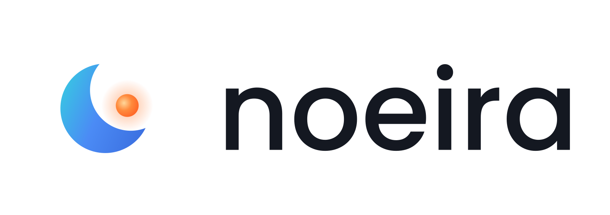

<!--
  The wordmark carries the project name, so it stands in for an `# noeira`
  heading; `alt` keeps the accessible name. <picture> + prefers-color-scheme is
  supported by GitHub, so the logo follows the reader's theme: the light file is
  dark-on-transparent, the dark file light-on-transparent. PNG rather than SVG
  because GitHub's image proxy is reliable with raster and inconsistent with SVG.
-->
<p align="center">
  <picture>
    <source media="(prefers-color-scheme: dark)" srcset="docs-site/src/assets/noeira-logo-transparent-dark-nobaseline-2x.png">
    
  </picture>
</p>

<p align="center">
  <b>Dream in simulation. Act in the world.</b><br>
  An end-to-end Physical AI stack in Mojo: physics, learning, perception and deployment, from simulator to robot.
</p>

<p align="center">
  <b>📖 Documentation — <a href="https://noeira.ai/docs">noeira.ai/docs</a></b>
</p>

noeira builds the whole robot-learning loop in one language: a MuJoCo-parity
physics engine and the task suites that run on it, reinforcement learning,
world models, imitation and vision-language-action policies, the camera and
servo-bus drivers of real robots, and the runtime that deploys a policy on the
robot's own computer. The policy that trains on a GPU box is the same Mojo code
that drives the robot.

> **Status:** beta, developed in the open (Modular Community Grant, 2026).
> The physics engine, the classic and MuJoCo-style environments, DQN / PPO /
> SAC / TD3 and `noeira.nn` are stable and tested. The task layer and its
> benchmarks, imitation learning on a real robot, dataset recording and edge
> deployment are beta. Vision-language-action models on a robot, learning from
> interventions, the world-model agents and DeepMind Control training are
> experimental. Each docs page carries its own maturity marker.

## What's inside

**Simulation**
- **3D physics** (`noeira/physics3d/`) — MuJoCo's generalized coordinates, MJCF loading (Menagerie, DeepMind Control, `<attach>`), PGS / Newton / CG solvers, elliptic cones, tendons, equality constraints, meshes, sensors, ray-traced cameras; checked against live MuJoCo 3.12, CPU and batched GPU
- **2D physics** (`noeira/physics2d/`) — GPU-batched impulse engine (LunarLander, BipedalWalker, CarRacing)
- **Environments** (`noeira/envs/`) — 350+ environments and tasks: classic control, MuJoCo-style locomotion and manipulation, DeepMind Control, LIBERO, Menagerie robots (Panda, SO-101, Unitree G1), arcade engines, an Atari 2600 emulator, Procgen and Craftax
- **Task layer** (`noeira/tasks/`) — declarative families, goals and placements; many tasks batched in one scene

**Learning**
- **Reinforcement learning** — tabular and linear methods, DQN / C51 / Rainbow, A2C / PPO, DDPG / TD3 / SAC / REDQ
- **World models and planning** — MBPO, TD-MPC2, DreamerV3, Dreamer 4, AlphaZero / MuZero / EfficientZero V2, MPPI / CEM / iLQR
- **Imitation and VLAs** — ACT, SmolVLA, behaviour cloning
- **From demonstrations** — HIL-SERL (RLPD + BC) with DAgger-style interventions
- **Zero-shot RL** — Forward-Backward representations (BFM-Zero on the Unitree G1)

**Robots**
- **Robot drivers** (`noeira/robot/`) — servo bus, calibration, teleoperation, opt-in arming; the first supported robot is the SO-101 arm
- **Vision** (`noeira/vision/`) — threaded camera capture, ChArUco intrinsics, camera-to-base extrinsics
- **Datasets** — recording in the LeRobot v3 format (Parquet + H.264), pushing to the Hugging Face Hub, importing back — a format, not a dependency, and no Python in the data path
- **Deployment** — the training code runs the policy on the robot's own computer and GPU; ACT closes its loop at 30 Hz on a Jetson Orin NX

**Infrastructure**
- **`noeira.nn`** — Module / Param networks whose gradients compose at compile time (each module's VJP, no tape), 70+ primitives, fused kernels, fused and flash attention, AMP, CUDA graphs
- **Data and I/O** — trajectory store (HDF5), replay buffers, Parquet, video, safetensors, HTTP
- **Projects and runs** — runs recorded on disk and mirrored to [noeira cloud](https://cloud.noeira.ai)
- **Rendering** — SDL3 renderers, ImGui viewers, a physics studio, video export

## Quick start

This project uses [pixi](https://pixi.sh) (`curl -fsSL https://pixi.sh/install.sh | bash`, or `brew install pixi`). `pixi install` also brings SDL3, which the viewers use; there is nothing to install system-wide.

```bash
pixi install

# A first example on the CPU (-I . puts the package on the module path)
pixi run mojo run -I . examples/solve_gridworld.mojo

# Train SAC on HalfCheetah on the GPU
pixi run -e apple  mojo run -I . examples/half_cheetah/sac_half_cheetah_training_gpu.mojo   # Apple Silicon
pixi run -e nvidia mojo run -I . examples/half_cheetah/sac_half_cheetah_training_gpu.mojo   # NVIDIA

# A task-family run: SAC on the SO-101 tower scene
pixi run -e nvidia mojo run -I . examples/tasks/sac_tower_gpu.mojo so101_tower_reach_clear

# The real arm: a read-only check of both SO-101 arms, then record teleop
pixi run soarm-diag
pixi run soarm-record -- --out <dataset-dir> --task "pick the cube"     # add --arm to move the follower
```

Platforms: `osx-arm64` (Metal), `linux-64` (CUDA 12), and `linux-aarch64` for the Jetson Orin (`pixi run -e jetson …`). The toolchain is pinned: Mojo 1.1.0, MAX 26.6.0. Start with [Installation](https://noeira.ai/docs/start/installation/).

## Documentation

Full documentation lives at **[noeira.ai/docs](https://noeira.ai/docs)** — this README is the summary.

| | |
|---|---|
| [Why noeira](https://noeira.ai/docs/start/why/) · [Installation](https://noeira.ai/docs/start/installation/) · [GPU quickstart](https://noeira.ai/docs/start/quickstart-gpu/) | what it is for, and a first run |
| [The stack](https://noeira.ai/docs/concepts/architecture/) · [Projects and runs](https://noeira.ai/docs/concepts/projects/) | how the pieces fit together |
| [3D physics](https://noeira.ai/docs/physics/physics3d/) · [Validation](https://noeira.ai/docs/physics/validation/) · [Environments](https://noeira.ai/docs/environments/) | the simulator and what runs on it |
| [The task layer](https://noeira.ai/docs/tasks/) · [LIBERO](https://noeira.ai/docs/environments/libero/) · [DeepMind Control](https://noeira.ai/docs/environments/dm-control/) | tasks and benchmarks |
| [Algorithms](https://noeira.ai/docs/algorithms/) · [Imitation and VLAs](https://noeira.ai/docs/algorithms/imitation/) | RL, world models, ACT, SmolVLA, HIL-SERL |
| [Robots](https://noeira.ai/docs/robots/) · [Jetson Orin](https://noeira.ai/docs/robots/jetson/) | robot drivers, cameras, recording, deployment |
| [Neural networks](https://noeira.ai/docs/nn/) · [Datasets](https://noeira.ai/docs/data/) · [noeira cloud](https://noeira.ai/docs/tooling/monitor/) | the infrastructure |
| [Toolchain](https://noeira.ai/docs/project/toolchain/) · [Testing](https://noeira.ai/docs/project/testing/) · [Contributing](https://noeira.ai/docs/project/contributing/) | working on noeira itself |

The site is built from `docs-site/`.

## Project structure

```
noeira/          the Mojo package
├── physics3d/ physics2d/ envs/ tasks/     simulation and tasks
├── nn/ data/ io/                           networks, datasets, native I/O
├── agents/ deep_agents/ planners/          learning
├── robot/ vision/                          the real world
├── core/ render/ math3d/ cuda/             traits and runs, rendering, math, CUDA
└── experimental/                           research code — APIs may break
examples/        runnable drivers, by environment or robot
tests/           the test suite (tests/manifests/ holds the curated tiers)
tools/           generators, reference dumps, hardware tools
docs-site/       the documentation site
```

## Acknowledgments

noeira leans on reference implementations throughout, as correctness oracles:
[MuJoCo](https://mujoco.org/) and the [MuJoCo Menagerie](https://github.com/google-deepmind/mujoco_menagerie) for physics and robot models,
[Gymnasium](https://github.com/Farama-Foundation/Gymnasium) and [DeepMind Control](https://github.com/google-deepmind/dm_control) for environments,
[LIBERO](https://github.com/Lifelong-Robot-Learning/LIBERO) and [robosuite](https://github.com/ARISE-Initiative/robosuite) for the manipulation benchmark,
[LeRobot](https://github.com/huggingface/lerobot) for its dataset format and the ACT and SmolVLA references,
and [HIL-SERL](https://github.com/rail-berkeley/hil-serl) for learning from interventions.
LeRobot and [Rerun](https://rerun.io) were an early inspiration for the robot side; noeira depends on neither.

## License

MIT — see [LICENSE](LICENSE).
