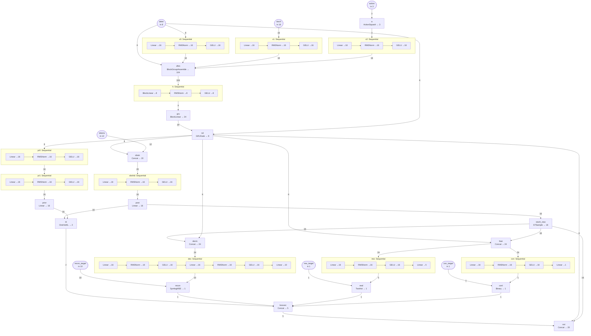

# DreamerV3 WMLossGraph

_Auto-generated by `examples/nn2/export_graph_mermaid.mojo`._

```mermaid
%% WMLossGraph
graph TD
  deter(["deter<br/>in 8"])
  stoch(["stoch<br/>in 16"])
  action(["action<br/>in 3"])
  tokens(["tokens<br/>in 12"])
  recon_target(["recon_target<br/>in 10"])
  rew_target(["rew_target<br/>in 1"])
  con_target(["con_target<br/>in 1"])
  a["a<br/>ActionSquash &rarr; 3"]
  subgraph x0 [x0: Sequential]
    x0__0["Linear →16"]
    x0__1["RMSNorm →16"]
    x0__2["GELU →16"]
    x0__0 --> x0__1
    x0__1 --> x0__2
  end
  subgraph x1 [x1: Sequential]
    x1__0["Linear →16"]
    x1__1["RMSNorm →16"]
    x1__2["GELU →16"]
    x1__0 --> x1__1
    x1__1 --> x1__2
  end
  subgraph x2 [x2: Sequential]
    x2__0["Linear →16"]
    x2__1["RMSNorm →16"]
    x2__2["GELU →16"]
    x2__0 --> x2__1
    x2__1 --> x2__2
  end
  dhin["dhin<br/>BlockGroupAssemble &rarr; 104"]
  subgraph h [h: Sequential]
    h__0["BlockLinear →8"]
    h__1["RMSNorm →8"]
    h__2["GELU →8"]
    h__0 --> h__1
    h__1 --> h__2
  end
  gru["gru<br/>BlockLinear &rarr; 24"]
  nd["nd<br/>GRUGate &rarr; 8"]
  obsin["obsin<br/>Concat &rarr; 20"]
  subgraph obshid [obshid: Sequential]
    obshid__0["Linear →16"]
    obshid__1["RMSNorm →16"]
    obshid__2["GELU →16"]
    obshid__0 --> obshid__1
    obshid__1 --> obshid__2
  end
  post["post<br/>Linear &rarr; 16"]
  subgraph pr0 [pr0: Sequential]
    pr0__0["Linear →16"]
    pr0__1["RMSNorm →16"]
    pr0__2["GELU →16"]
    pr0__0 --> pr0__1
    pr0__1 --> pr0__2
  end
  subgraph pr1 [pr1: Sequential]
    pr1__0["Linear →16"]
    pr1__1["RMSNorm →16"]
    pr1__2["GELU →16"]
    pr1__0 --> pr1__1
    pr1__1 --> pr1__2
  end
  prior["prior<br/>Linear &rarr; 16"]
  kl["kl<br/>OneHotKL &rarr; 2"]
  stoch_new["stoch_new<br/>STSample &rarr; 16"]
  decin["decin<br/>Concat &rarr; 24"]
  subgraph dec [dec: Sequential]
    dec__0["Linear →16"]
    dec__1["RMSNorm →16"]
    dec__2["GELU →16"]
    dec__3["Linear →16"]
    dec__4["RMSNorm →16"]
    dec__5["GELU →16"]
    dec__6["Linear →10"]
    dec__0 --> dec__1
    dec__1 --> dec__2
    dec__2 --> dec__3
    dec__3 --> dec__4
    dec__4 --> dec__5
    dec__5 --> dec__6
  end
  recon["recon<br/>SymlogMSE &rarr; 1"]
  feat["feat<br/>Concat &rarr; 24"]
  subgraph rew [rew: Sequential]
    rew__0["Linear →16"]
    rew__1["RMSNorm →16"]
    rew__2["GELU →16"]
    rew__3["Linear →5"]
    rew__0 --> rew__1
    rew__1 --> rew__2
    rew__2 --> rew__3
  end
  rewl["rewl<br/>TwoHot &rarr; 1"]
  subgraph con [con: Sequential]
    con__0["Linear →16"]
    con__1["RMSNorm →16"]
    con__2["GELU →16"]
    con__3["Linear →1"]
    con__0 --> con__1
    con__1 --> con__2
    con__2 --> con__3
  end
  conl["conl<br/>Binary &rarr; 1"]
  lossvec["lossvec<br/>Concat &rarr; 5"]
  out["out<br/>Concat &rarr; 29"]
  action -->|3| a
  deter -->|8| x0
  stoch -->|16| x1
  a -->|3| x2
  deter -->|8| dhin
  x0 -->|16| dhin
  x1 -->|16| dhin
  x2 -->|16| dhin
  dhin -->|104| h
  h -->|8| gru
  gru -->|24| nd
  deter -->|8| nd
  nd -->|8| obsin
  tokens -->|12| obsin
  obsin -->|20| obshid
  obshid -->|16| post
  nd -->|8| pr0
  pr0 -->|16| pr1
  pr1 -->|16| prior
  post -->|16| kl
  prior -->|16| kl
  post -->|16| stoch_new
  stoch_new -->|16| decin
  nd -->|8| decin
  decin -->|24| dec
  dec -->|10| recon
  recon_target -->|10| recon
  nd -->|8| feat
  stoch_new -->|16| feat
  feat -->|24| rew
  rew -->|5| rewl
  rew_target -->|1| rewl
  feat -->|24| con
  con -->|1| conl
  con_target -->|1| conl
  kl -->|2| lossvec
  recon -->|1| lossvec
  rewl -->|1| lossvec
  conl -->|1| lossvec
  lossvec -->|5| out
  nd -->|8| out
  stoch_new -->|16| out
```
